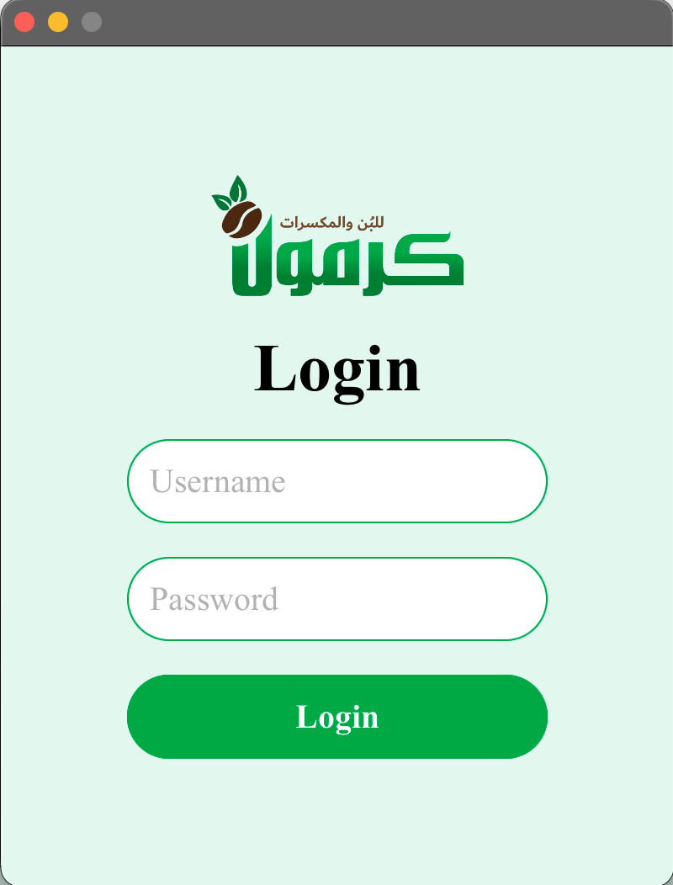
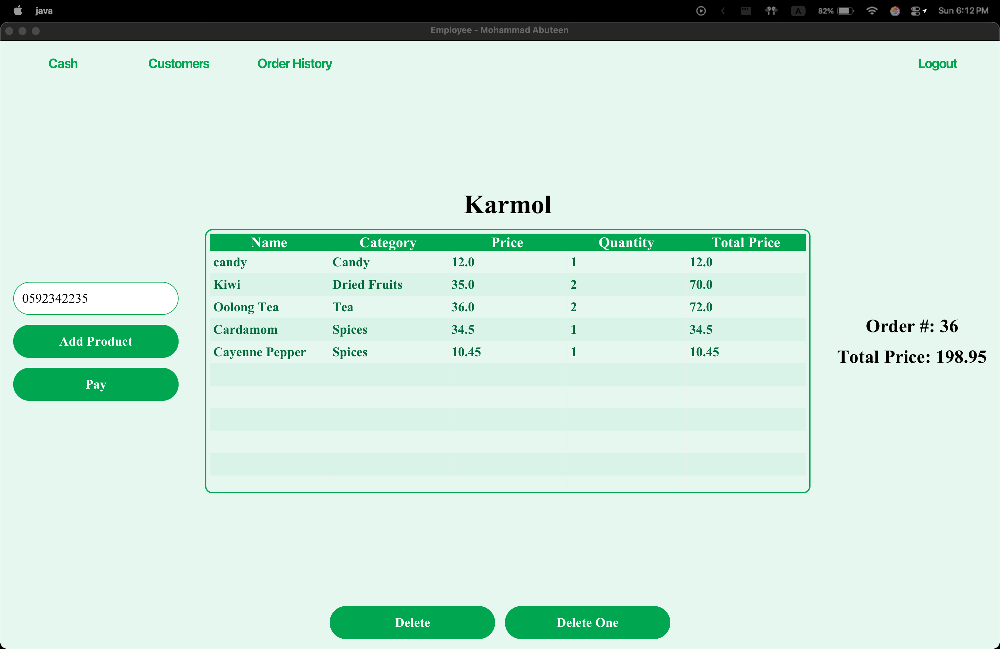
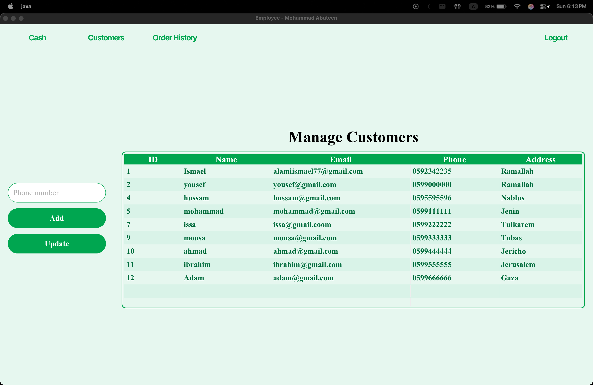
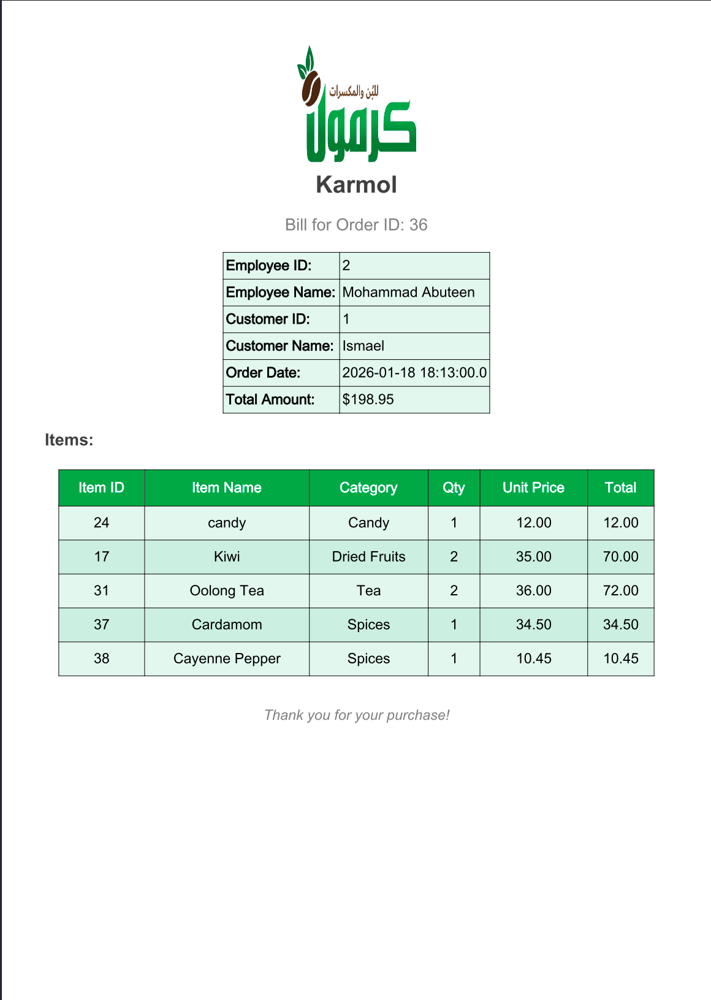
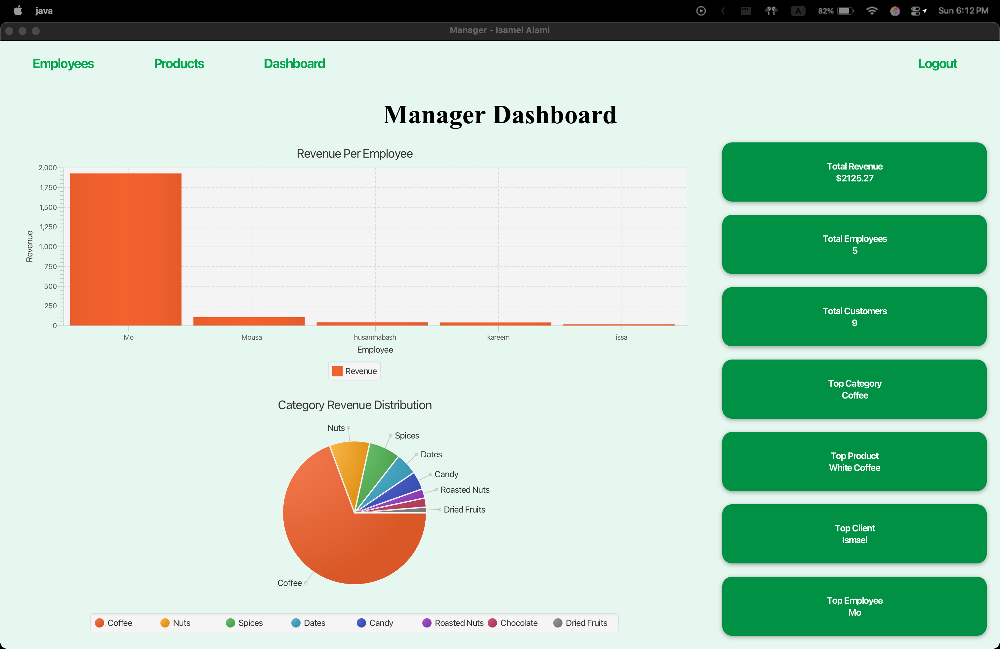

# Karmol POS System ☕🧾

Karmol is a **JavaFX-based Point of Sale (POS) system** developed as a university project.  
It supports **sales processing, inventory management, customer tracking, employee management, and reporting dashboards** using a MySQL database.

---

## 🚀 Features

### 🔐 Authentication
- User login system

### 💵 Cash System (POS)
- Product browsing by category
- Cart system with quantity control
- Stock validation (UI + database level)
- Customer selection by phone number
- Order creation with order items
- Automatic stock deduction
- Invoice / order history tracking

### 📦 Inventory Management
- Add, update, and view products
- Category-based product organization
- Stock quantity management
- Soft-delete friendly design (recommended)

### 👥 Customer Management
- Add and update customers
- Search customers by phone
- Link customers to orders

### 🧑‍💼 Employee Management
- Add and update employees
- View employee list
- Track sales per employee

### 📊 Manager Dashboard
- Total revenue
- Total customers
- Total employees
- Sales per employee (Bar Chart)
- Revenue by category (Pie Chart)
- Top product / category / employee insights

---

## 📸 Screenshots

### 🔐 Login Screen

### 💵 Cashier POS Screen

### 👥 Customer Management

### 🧾 Order History

### 🧾 Bill / Invoice

### 📊 Manager Dashboard

### 👥 Employee Management

### 📦 Product Management

